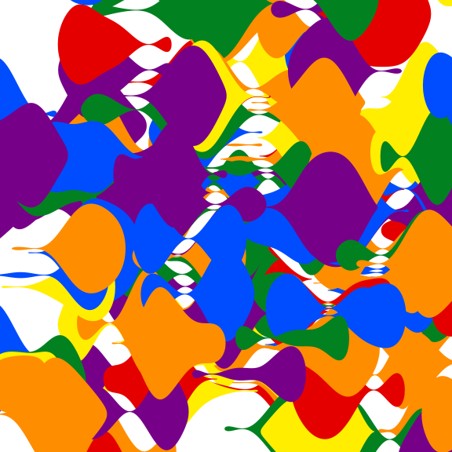

# sketchpad

sketchpad is a lightweight drawing system for generative art, built on
[S7](https://rconsortium.github.io/S7/) classes and `grid` graphics. It
provides a small set of `drawable` shapes
([`shape_circle()`](https://sketchpad.djnavarro.net/reference/shape_circle.md),
[`shape_blob()`](https://sketchpad.djnavarro.net/reference/shape_blob.md),
[`shape_ribbon()`](https://sketchpad.djnavarro.net/reference/shape_ribbon.md),
[`shape_twist()`](https://sketchpad.djnavarro.net/reference/shape_twist.md))
that can be composed into a
[`sketch()`](https://sketchpad.djnavarro.net/reference/sketch.md) and
rendered with
[`draw()`](https://sketchpad.djnavarro.net/reference/draw.md).

## Installation

You can install the development version of sketchpad from
[GitHub](https://github.com/) with:

``` r

# install.packages("pak")
pak::pak("djnavarro/sketchpad")
```

## A ring of blobs

A
[`shape_blob()`](https://sketchpad.djnavarro.net/reference/shape_blob.md)
is a circle whose radius is perturbed by simplex noise. Here six blobs
are arranged around a ring, one per colour:

``` r

library(sketchpad)

values <- tibble::tibble(
  x = cos(seq(0, pi * 5 / 3, length.out = 6)),
  y = sin(seq(0, pi * 5 / 3, length.out = 6)),
  n = 500L,
  fill = c("#e50000", "#ff8d00", "#ffee00", "#028121", "#004cff", "#770088"),
  color = fill
)
blobs <- purrr::pmap(values, shape_blob)
blobs |> sketch() |> draw()
```


## Scattered blobs

Randomising the position, radius, and noise range of many blobs gives a
more organic composition:

``` r

set.seed(3)
palette <- c("#e50000", "#ff8d00", "#ffee00", "#028121", "#004cff", "#770088")
n_blobs <- 200L
values <- tibble::tibble(
  x = rnorm(n_blobs, sd = 1.5),
  y = rnorm(n_blobs, sd = 1.5),
  n = 500L,
  fill = sample(palette, n_blobs, replace = TRUE),
  radius = runif(n_blobs),
  range = runif(n_blobs, min = 0, max = .5),
  color = fill
)
blobs <- purrr::pmap(values, shape_blob)
blobs |> sketch() |> draw(xlim = c(-2, 2), ylim = c(-2, 2))
```


## Ribbons

A
[`shape_ribbon()`](https://sketchpad.djnavarro.net/reference/shape_ribbon.md)
is a tapered, noise-displaced band drawn between two points:

``` r

set.seed(3)
palette <- c("#e50000", "#ff8d00", "#ffee00", "#028121", "#004cff", "#770088")
n_ribbons <- 200L
values <- tibble::tibble(
  x = rnorm(n_ribbons, sd = 1.5),
  y = rnorm(n_ribbons, sd = 1.5),
  xend = x + 1,
  yend = y,
  width = 1,
  n = 500L,
  fill = sample(palette, n_ribbons, replace = TRUE),
  color = fill
)
ribbons <- purrr::pmap(values, shape_ribbon)
ribbons |> sketch() |> draw(xlim = c(-2, 2), ylim = c(-2, 2))
```



## Twists

A
[`shape_twist()`](https://sketchpad.djnavarro.net/reference/shape_twist.md)
is like a ribbon, but follows a Brownian bridge instead of a straight
line, giving it a wandering, twisted appearance:

``` r

set.seed(1)
palette <- c("#de9151", "#f34213", "#2e2e3a", "#bc5d2e", "#bbb8b2")
n_twists <- 400L
values <- tibble::tibble(
  x = rnorm(n_twists, sd = 2),
  y = rnorm(n_twists, sd = 2),
  xend = x + 1,
  yend = y + rnorm(n_twists, sd = 1),
  width = runif(n_twists, min = .1, max = .3),
  path_distortion = list(noise_bridge(smooth = 6L)),
  n = 100L,
  fill = sample(palette, n_twists, replace = TRUE),
  color = fill
)
twists <- purrr::pmap(values, shape_twist)
twists |> sketch() |> draw(xlim = c(-2, 2), ylim = c(-2, 2))
```


